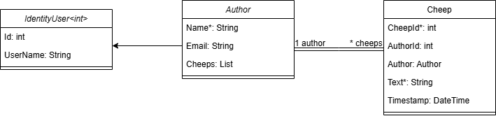
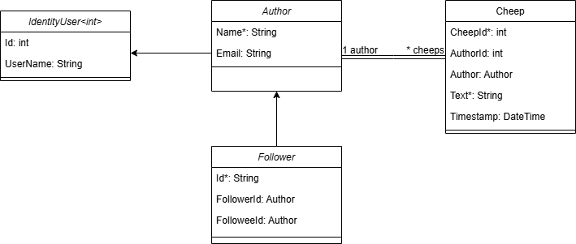
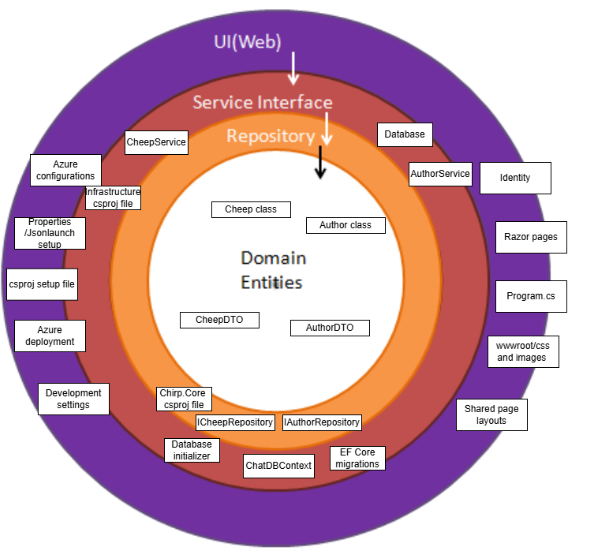
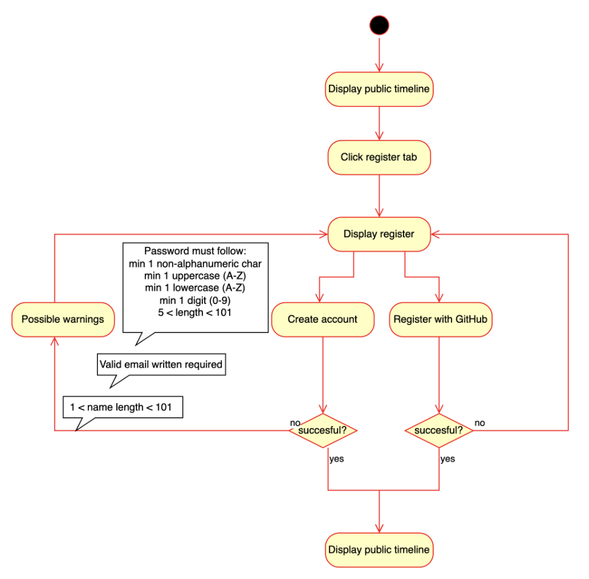
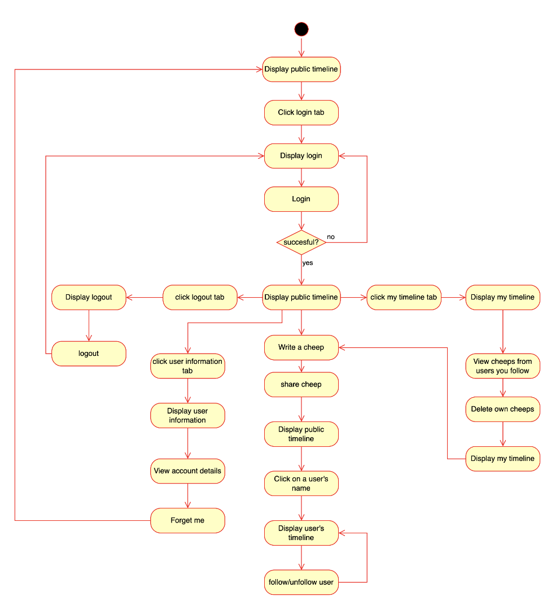
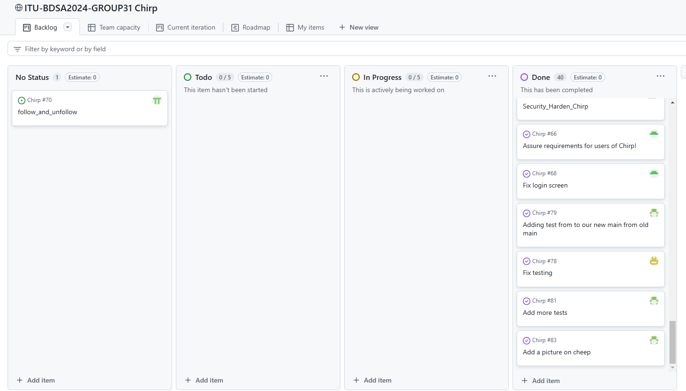

# Design and Architecture of _Chirp!_

## Domain Model

<div align="center">
    
</div>

The domain model for the Chirp application consists of two main entities: **Author** and **Cheep**, which represent users and their posts, respectively. The **Author** entity inherits from `IdentityUser<int>` to integrate with ASP.NET Core Identity for authentication and user management. Each Author has a unique `Id`, a `Name` (required), and an optional `Email`. An Author can also have a list of **Cheeps** that they have posted.

The **Cheep** entity represents post authored by a user. It contains a unique identifier `CheepId`, a foreign key `AuthorId` referencing the Author, the content of the post in the `Text` field (limited to 160 characters), and a `Timestamp` indicating when the post was created. Each Cheep is associated with exactly one Author, establishing a **one-to-many relationship** between Authors and their Cheeps.

### Changes to the Domain Model

As of writing this report, it is not possible to follow other users, but when this feature is implemented, the domain model will be extended to include functionality for **user relationships**.

This change introduces a new entity: **Follower**, which enables a **many-to-many relationship** between Authors.

The **Follower** entity will include:

- `Id`: The unique identifier for the relationship.
- `FollowerId`: A reference to the Author who is following another Author.
- `FolloweeId`: A reference to the Author being followed.

Each Author will gain two new collections:

- `Followers`: A list of **Follower** entities representing the Authors who are following them.
- `Following`: A list of **Follower** entities representing the Authors they are following.

<div align="center">
    
</div>

This change will enable the system to track follower-followee relationships while maintaining data integrity. The **Follower** entity will act as a bridge table, ensuring scalability and flexibility for managing user relationships. Once this functionality is completed, the domain model will support features like displaying followers, private timelines, and more.

## Architecture — In the small

The Onion Architecture can be visually represented as follows:

<div align="center">
    
</div>

# Introduction

Onion Architecture is a software design pattern that focuses on creating a robust, maintainable, and testable application by organizing the codebase into layers. It emphasizes a clear separation of concerns, where each layer has its specific responsibility and dependencies flow inward toward the core. This structure ensures that the system’s core domain logic remains independent of external frameworks, user interfaces, and infrastructure. This makes it highly adaptable to change.

The architecture resembles an onion, where the innermost layers represent the most critical and stable components of the system, while the outer layers depend on these core elements. At the center lies the **Domain Entities**, which stores the core logic and essential data structures. Moving outward, we encounter layers like the **Repository Layer** for data persistence, the **Service Interface Layer** for workflow operations, and the **UI/Web Layer** for user interactions. Surrounding all these layers are **Infrastructure and Configuration** components, which support and enable the application to function seamlessly in different environments.

This layered approach not only ensures flexibility and scalability but also enhances testability by decoupling components.

---

## UI/Web Layer

The **UI/Web Layer** sits at the outermost part of the architecture and is responsible for all user interaction and presentation. This layer includes:

- **Razor pages** for building dynamic and interactive user interfaces.
- Shared components like **page layouts** to ensure consistency across the application.
- Integrated **Identity** to handle user authentication and authorization, providing secure access to the system.
- Resources such as stylesheets and images, organized in the `wwwroot` folder, ensuring a clean structure for web elements.
- The `Program.cs` file, serving as the main entry point for the application, initializing and configuring the entire system (e.g., dependency injections).

---

## Service Interface Layer

Moving inward, the **Service Interface Layer** acts as a bridge between the UI and the underlying layers. This is where we define service classes like the `CheepService` and `AuthorService`, which store the core operations for the application. These services:

- Interact with repositories to retrieve or manipulate data.
- Ensure workflows remain consistent.

By isolating this functionality in its own layer, we achieve a clear separation of concerns, making the codebase easier to test, maintain, and extend. This layer can also support multiple purposes.

---

## Repository Layer

The next layer is the **Repository Layer**, which handles all data persistence and database interactions. This layer:

- Abstracts the complexities of working with the database.
- Provides clean, reusable methods for accessing and managing data.

Key components include:

- Repositories like `CheepRepository` and `AuthorRepository`, which operate on domain objects.
- The `ChatDBContext`, serving as the central Entity Framework context, managing database communication.
- Tools like **EF Core migrations** to ensure the database schema evolves smoothly.
- A **Database initializer** to help set up the database as needed.

This layer ensures a clean and consistent way of accessing data across the application.

---

## Domain Entities

At the very core of the architecture lies the **Domain Entities** layer, which represents the heart of the system. This layer defines:

- Core logic and essential domain objects, such as the `Cheep` class and `Author` class, which store data and behavior central to the application’s functionality.
- Supporting classes like `CheepDTO` and `AuthorDTO`, lightweight objects used for safely transferring data between layers.

This layer is completely isolated from infrastructure and external dependencies, ensuring it remains the most stable and reusable part of the architecture, as it operates independently.

---

## Infrastructure and Configuration

Surrounding all the layers are important **Infrastructure and Configuration** components that enable the application to function effectively in different environments. These include:

- **Azure configurations** for cloud deployment.
- **JSON launch settings** for runtime configurations.
- `.csproj` files that manage project dependencies and setup.

Additional components, such as development-specific settings, deployment scripts, and configurations, ensure the application is easy to test, deploy, and maintain across development and production environments.

## Architecture of deployed application

## User activities

To understand the activities a user can perform in our implementation of Chirp, we have prepared two UML activity diagrams. One diagram dedicated to the activities of a non-authorized user, and another devoted to illustrate the possible acts of an authenticated user.

<div align="center">
    
</div>

<div align="center">
    
</div>

Naturally the amount of activities when authenticated is far more than the possible activities of a non-authorized user. In the first diagram (non-authorized user) we see the activity of registering an account, whilst we in the second diagram (authenticated user) see all the possible activities of a logged in user such as, writing a cheep, deleting a cheep, following another user, logging out and so on. Together the two UML activity diagrams sum up the journey, through our implementation of Chirp, that a user will have the possibility of going through.

## Sequence of functionality/calls trough _Chirp!_

# Process

## Build, test, release, and deployment

## Team work

### Project board

This is the current project board

<div align="center">
    
</div>

The only missing major feature is follow and unfollow which we will attempt to implement before the exam.

### Our process when creating a new issue:

When creating an issue we assigned different group members to different issues based on what the individual group members wanted to work on and what was possible in the given situation. At the beginning of the project we often solved issues with the entire group at the same time using the code with me extension in Rider, but later we started splitting up into teams of two people using pair programming.

When creating an issue we labelled it based on which area of the project they would fall under.
Additionally we decided not to describe user stories when naming our issues due to the preference of the group and our TA who approved of our naming convention.

After the issue was created, a github workflow ensured that a branch with a corresponding name was created.

As mentioned, at the beginning of the project and sporadically during the end of it, we worked on issues as the entire group. One person shared their screen through a tv or using the code with me extension to the entire group so we could all participate in the development of a feature simultaneously. This was particularly beneficial when development on some features were halted due to other features being required first, thereby avoiding some group members being idle while waiting for other to complete their development.

When it wasn't necesscary for the entire group to be working on one feature we split up the work and assigned groups of two individuals to work on a feature or enhancement. When working in groups of two we utilized pair programming, the only change from traditional pair programming was further use of the code with me extension since we weren't always at the same physical location.

At the start, when we were finished developing on a branch we simply merged the branch into the main branch. But later on in the project we started creating pull requests which includes the summary of the changes, the purpose of them and any relevant context and details.

Then a github workflow will run which builds the project and runs the test making sure that nothing is broken.

After the workflow has ran and if nothing is broken, random group member(s) was assigned to review and examine the code changes for correctnes, and readability.
If there were no issues with the changes, the reviewer(s) would approve the PR and the branch would be merged into the main branch.

## How to make _Chirp!_ work locally

To run the Chirp! application locally, follow these step-by-step instructions. The Chirp! system is a Razor Pages web application built using ASP.NET Core with a SQLite database.

---

#### **Prerequisites**

Ensure that the following tools are installed on your system:

1. **.NET SDK** (minimum version 8.0) – [Download here](https://dotnet.microsoft.com/download).
2. **Git** – [Download here](https://git-scm.com/downloads).

#### **Setup Steps**

1. **Clone the Repository**

Start by cloning the Chirp! project to your local machine using Git:

```bash
git clone https://github.com/ITU-BDSA2024-GROUP31/Chirp.git
cd Chirp
```

2. **Set Up Configuration**

Setup your github client id and client secret for Github OAuth, To set up credentials use dotnet user-secrets:

```bash
dotnet user-secrets init
dotnet user-secrets set "authentication_github_clientId" "<YOUR_CLIENTID>"
dotnet user-secrets set "authentication_github_clientSecret" "<YOUR_CLIENTSECRET>"
```

3. **Build Application**

Restore dependencies and build the project:

```bash
dotnet build
```

4. **Run Database Migrations**

Apply database migrations to initialize the SQLite database:

```bash
dotnet ef database update
```

This ensures that all required tables are created.

5. **Run Application**

Start the development server with the following command:

```bash
dotnet run
```

6. **Open Application in web browser**
   Open your web browser and navigate to:

[Localhost](http://localhost:5273/)

## How to run test suite locally

# Ethics

## License

We opted for the MIT License in our application, and there are several reasons for that. The MIT License is short, easy to understand and imposes very few restrictions. It allows for others to modify and freely use the code (also commercially), making it simple and flexible. The unrestricted use that is offered through the MIT License increases the likelihood of others contributing to or building upon the software. Whilst being so flexible and simple it still ensures that proper credit is given to the author(s) of the software. All these advantages are great, however there are also some downsides that we considered. Unlike other licenses the MIT License does not require developers that modify the software/improve it, to share it with the public. This could lead to fewer contributions coming back to the open-source ecosystem. Another aspect that was considered is the fact that the MIT License ensures no warranty or liability, meaning the software is provided “as is” and developers cannot hold the author(s) responsible for any problems resulting from using the software. Whilst this could be seen as an advantage for us as authors of the software, it is a disadvantage for the users of the software, as they’re using it at their own risk. Weighing the upsides against the downsides, we found the MIT License as being a great option, which is why it became the License of choice for our application.

## LLMs, ChatGPT, CoPilot, and others

During development we made use of ChatGPT and CoPilot. The two played the same role in our development, but one was used over the other, depending on what the given group member had available on their computer. They were mainly used when we encountered errors that we couldn’t handle on top of our heads, or when we had logical errors where we couldn’t see the mistake. The responses from the LLMs were typically helpful, but every now and then their responses either introduced new problems that we had to solve as a consequence of solving the previous one, or just did not work at all. This could be due to several factors such as, the LLM lacking context of our code, the LLM not understanding what we intended or not being able to help for some other reason. It is safe to say that these downsides led to a slower development sometimes, but looking at it overall they were pretty helpful, and they definitely sped up the development of our application, as some of our challenges would be far more time consuming to solve without an assisting tool such as ChatGPT or CoPilot.
