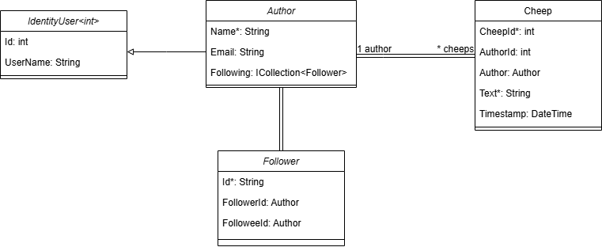

# Design and Architecture of _Chirp!_

## Domain Model

<div align="center">
    
</div>

The domain model for the Chirp application consists of two main entities: **Author** and **Cheep**, which represent users and their posts, respectively. The **Author** entity inherits from `IdentityUser<int>` to integrate with ASP.NET Core Identity for authentication and user management. Each Author has a unique `Id`, a `Name` (required), and an optional `Email`. An Author can also have a list of **Cheeps** that they have posted.

The **Cheep** entity represents post authored by a user. It contains a unique identifier `CheepId`, a foreign key `AuthorId` referencing the Author, the content of the post in the `Text` field (limited to 160 characters), and a `Timestamp` indicating when the post was created. Each Cheep is associated with exactly one Author, establishing a **one-to-many relationship** between Authors and their Cheeps.

### Changes to the Domain Model

As of writing this report, it is not possible to follow other users, but when this feature is implemented, the domain model will be extended to include functionality for **user relationships**.

This change introduces a new entity: **Follower**, which enables a **many-to-many relationship** between Authors.

The **Follower** entity will include:

- `Id`: The unique identifier for the relationship.
- `FollowerId`: A reference to the Author who is following another Author.
- `FolloweeId`: A reference to the Author being followed.

Each Author will gain two new collections:

- `Followers`: A list of **Follower** entities representing the Authors who are following them.
- `Following`: A list of **Follower** entities representing the Authors they are following.

<div align="center">
    
</div>

This change will enable the system to track follower-followee relationships while maintaining data integrity. The **Follower** entity will act as a bridge table, ensuring scalability and flexibility for managing user relationships. Once this functionality is completed, the domain model will support features like displaying followers, private timelines, and more.

## Architecture — In the small

## Architecture of deployed application

## User activities

## Sequence of functionality/calls trough _Chirp!_

# Process

## Build, test, release, and deployment

## Team work
This is the project board at the time of writing before submission of the report
<div align="center">
    
</div>

### Our process when creating a new issue:

When creating an issue we assigned different group members to different issues based on what the individual group members wanted to work on and what was possible in the given situation. At the beginning of the project we often solved issues with the entire group at the same time using the code with me extension in Rider, but later we started splitting up into teams of two people using pair programming.

When creating an issue we labelled it based on which area of the project they would fall under.
Additionally we decided not to describe user stories when naming our issues due to the preference of the group and our TA who approved of our naming convention.

After the issue was created, a github workflow ensured that a branch with a corresponding name was created.

As mentioned, at the beginning of the project and sporadically during the end of it, we worked on issues as the entire group. One person shared their screen through a tv or using the code with me extension to the entire group so we could all participate in the development of a feature simultaneously. This was particularly beneficial when development on some features were halted due to other features being required first, thereby avoiding some group members being idle while waiting for other to complete their development.

When it wasn't necesscary for the entire group to be working on one feature we split up the work and assigned groups of two individuals to work on a feature or enhancement. When working in groups of two we utilized pair programming, the only change from traditional pair programming was further use of the code with me extension since we weren't always at the same physical location. 

At the start, when we were finished developing on a branch we simply merged the branch into the main branch. But later on in the project we started creating pull requests which includes the summary of the changes, the purpose of them and any relevant context and details. 

Then a github workflow will run which builds the project and runs the test making sure that nothing is broken.

After the workflow has ran and if nothing is broken, random group member(s) was assigned to review and examine the code changes for correctnes, and readability.
If there were no issues with the changes, the reviewer(s) would approve the PR and the branch would be merged into the main branch


## How to make _Chirp!_ work locally

To run the Chirp! application locally, follow these step-by-step instructions. The Chirp! system is a Razor Pages web application built using ASP.NET Core with a SQLite database.

---

#### **Prerequisites**

Ensure that the following tools are installed on your system:

1. **.NET SDK** (minimum version 8.0) – [Download here](https://dotnet.microsoft.com/download).
2. **Git** – [Download here](https://git-scm.com/downloads).

#### **Setup Steps**

1. **Clone the Repository**

Start by cloning the Chirp! project to your local machine using Git:

```bash
git clone https://github.com/ITU-BDSA2024-GROUP31/Chirp.git
cd Chirp
```

2. **Set Up Configuration**

Setup your github client id and client secret for Github OAuth, To set up credentials use dotnet user-secrets:

```bash
dotnet user-secrets init
dotnet user-secrets set "authentication_github_clientId" "<YOUR_CLIENTID>"
dotnet user-secrets set "authentication_github_clientSecret" "<YOUR_CLIENTSECRET>"
```

3. **Build Application**

Restore dependencies and build the project:

```bash
dotnet build
```

4. **Run Database Migrations**

Apply database migrations to initialize the SQLite database:

```bash
dotnet ef database update
```

This ensures that all required tables are created.

5. **Run Application**

Start the development server with the following command:

```bash
dotnet run
```

6. **Open Application in web browser**
Open your web browser and navigate to:

[Localhost](http://localhost:5273/)


## How to run test suite locally

# Ethics

## License

## LLMs, ChatGPT, CoPilot, and others
